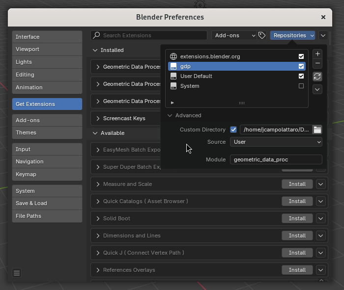

# Geometric Data Processing at TU Delft

This repository contains the materials of the Geometric Data Processing course offered by the Computer Graphics and Visualization Group at TU Delft. A description of the materials can be found at [this document](https://docs.google.com/document/d/1uSozhnwYljo1nvCmgNk0HmbbYe3NGOF1ZlqnHkmzwfc/edit?usp=sharing).

#### Professor

Klaus Hildebrandt (k.a.hildebrandt@tudelft.nl)

#### TAs

- Jackson Campolattaro (j.r.c.campolattaro@tudelft.nl)
- Ali Samadzadeh (a.samadzadeh@tudelft.nl)

## Setting up your Development Environment

Before starting, you will need to set up your Python environment. The necessary Python version and packages for this project are defined in `pyproject.toml`. You can install them using your IDE's package management features, or a package manager like `venv`, `conda`, or `uv`. We recommend uv because of its speed, ease of use, and stronger guarantees about package compatibility.

You can install uv for your system [here](https://docs.astral.sh/uv/getting-started/installation/). The instructions in this document will all assume you are using uv from the command line.
_If you run into trouble while using another package manager, you can leave a message on Brightspace or ask for help
during the tutorials._

### Outside of Blender

For some parts of the assignments, you will need to run your python code outside of blender. You can install the packages you need by `cd`'ing to the directory containing this README and calling the following:

```bash
uv sync --dev
```

This installs the packages your python addons will use (`numpy`, `scipy`, etc.) to a `.venv` directory.
_This only needs to be done once, or after `pyproject.toml` is edited._

Because of the `--dev` flag, it will also install dependencies from a second list in `pyproject.toml`, including `bpy` which provides access to Blender's libraries outside of Blender's python interpreter and `pytest` which will be used to run your unit tests. If you're using a tool other than `uv`, make sure to still install the dev dependencies.

You should now be prepared to run python scripts from outside blender!
You can set your IDE's python interpreter to the one inside the new `.venv`
(instructions may depend on your IDE of choice). Or else try running the test script directly from the command line with uv:

```bash
uv run test.py
```

After running for few moments, this should show a couple of (failing!) unit-test results for the assignments.

### Inside Blender

Preparing a Blender extension is slightly more complicated, as Blender provides its own Python interpreter. It's simple to experiment with scripts and simple addons inside Blender's scripting workspace, but when writing more complicated addons, it's nicer to split code into multiple files and use your preferred editor.

Blender 4.2 introduced a new system that standardized how extensions are defined. This simplified many things, but it also means that a lot of documentation online is outdated. To help with this, we provide the extension structure for you in the assignment template.

#### Installing Dependencies

Blender's Python interpreter can't load the packages installed in a `.venv` file. Instead, modern Blender extensions need to include each of their dependencies directly as "wheel" files, with their locations listed in the extension's `blender_manifest.toml`.

Manually getting the right `.whl` files downloaded in the right places and listing them in the manifest can be a finicky process, so we've automated it with a simple script. To set up all the regular dependencies listed in your `pyproject.toml` (including any you add!), you can call the following:

```bash
uv run setup_deps.py
```

This will download the appropriate `.whl` files for your OS and system architecture into a new `.wheels` directory. It also edits the assignment's `blender_manifest.toml` to point to these files.

_This only needs to be done once, or after `pyproject.toml` is edited._

#### Loading your Extension

Loading an extension in blender is simpler, but we also provide a script that automates this process:

```bash
uv run setup_blender.py
```

This is equivalent to opening Blender and navigating to `Edit` > `Preferences` > `Get Extensions`
and manually adding an extension repository with parameters like the following:



After this is done, this directory acts as a repository, and each `blender_manifest.toml` defines an addon provided by the repository. The script also enables all the addon in the repository, equivalent to navigating to `Edit` > `Preferences` > `Add-Ons` and checking the 'enable' boxes.

_This only needs to be done once, or each time a new addon is created in the project directory._

#### Reloading your Code

Once the project directory is added as a repository and the addons are all enabled, the latest version of your code will be loaded each time Blender is opened!

_Unfortunately, older methods of enabling hot-reloading don't seem to be supported by the latest versions of Blender!_
_We haven't found a way to get `F3` > `Reload Scripts` to refresh the addon from the repository._
_If you discover a working approach, let us know!_
_In the meantime, we recommend doing most of your development outside Blender by writing unit tests._

