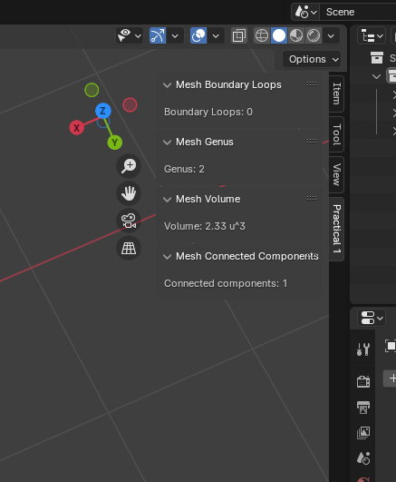
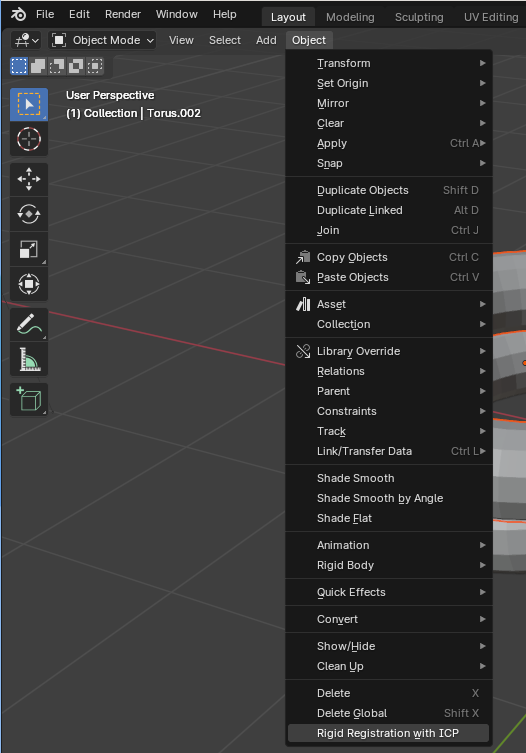
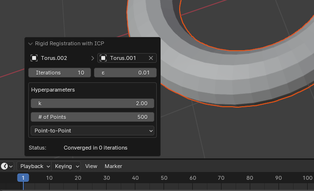

# Assignment 1

Parts of this assignment will be automatically graded, to receive full points you will need to complete the functions listed in the following directory structure:

- assignment1
    - \_\_init\_\_.py
    - README.md
    - genus
        - \_\_init\_\_.py
        - genus.py
            - `mesh_genus()`
        - ui.py
        - test_genus.py
    - volume
        - \_\_init\_\_.py
        - volume.py
        - ui.py
        - test_volume.py
    - boundaries
        - \_\_init\_\_.py
        - boundary_loops.py
            - `mesh_boundary_loops()`
        - ui.py
        - test_boundaries.py
    - components
        - \_\_init\_\_.py
        - connected_components.py
            - `mesh_connected_components()`
        - ui.py
        - test_components.py
    - registration
        - \_\_init\_\_.py
        - iterative_closest_point.py
            - `point_to_point_transformation()`
            - `point_to_plane_transformation()`
            - `closest_point_registration()`
            - `iterative_closest_point_registration()`
        - experiment.py
        - ui.py
        - test_registration.py

In each file, the necessary function stubs are already present, with some documentation explaining their purpose and expected behavior. More details are provided in the assignment packet itself, as well as some useful implementation hints.
_Make sure not to modify these function signatures, as they are expected by the grading script._

If you're not sure where to start, look for the `# TODO: ...` comments!

You may modify any other functions, and writing your own helper methods will likely make the tasks easier.

**Generative AI tools may not be used for this part of the assignment!**

## Unit tests

We also provide a handful of simple unit tests (found in `assignment1/{task}/test_{task}.py`). These are a small subset of the tests we will use for grading, so if your code passes all of these tests that doesn't guarantee a perfect score. We recommend adding more unit tests of your own -- it's a lot faster than manually checking in the UI! You can find some more sample data in `../data/`, and expected values (where relevant) in `../data/mesh_properties.csv`.

## Manually Graded UI Components & Extra Points

This assignment also has a handful of manually-tested features, these appear in each `assignment1/{task}/ui.py`. This is where you will define your UI components for Blender.

`genus`, `volume`, `boundaries`, and `components` each have their own Panel which show the properties of the currently selected mesh. To see these, you must open the 'Assignment 1' tab immediately to the left of the object tree, as shown:

`registration` has an Operator which can be accessed from the `Object` menu, as shown here:

Note that this option will only be available when there are at least two different objects in the scene -- you can't register an object to itself!

Selecting the rigid registration option will open the following Operator, which allows you to select an object to register against and configure parameters:

The Operator comes with code which invokes the rigid registration functions to move the currently selected object to the chosen target. The operation will be re-done any time one of the parameters changes, so if your solution is performant enough you can adjust the 'iterations' slider and watch the registration process in real-time.

Each of these UI elements has some provided stub code, with progressively less implementation included. Creating a very simple UI for each task should be straightforward, but you can earn extra points by doing something more creative. We've listed some ideas in the files, but if you think of something you'd like to try, you're welcome to message us or tell us your idea during the practicum session!